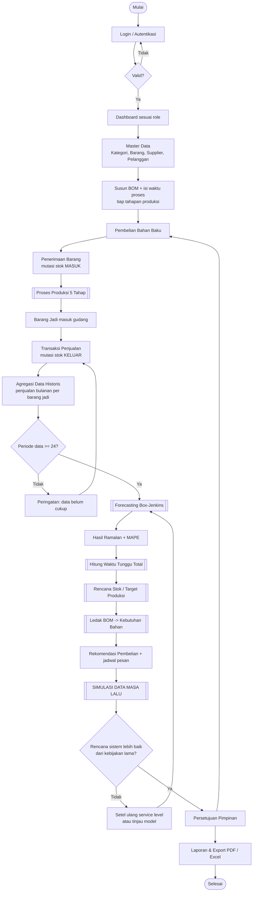
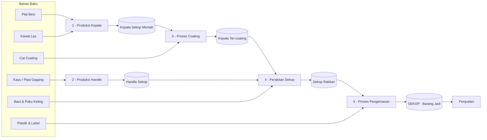
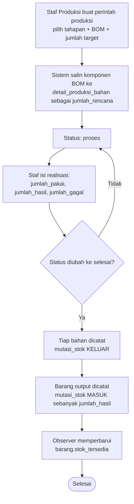
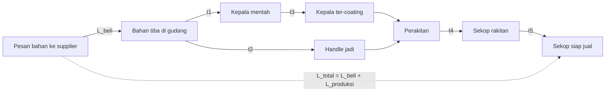
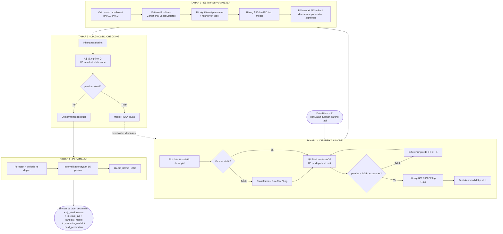
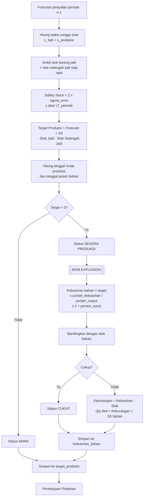
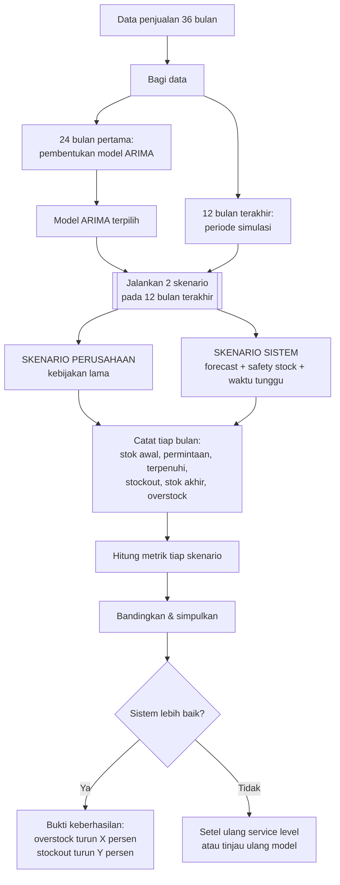
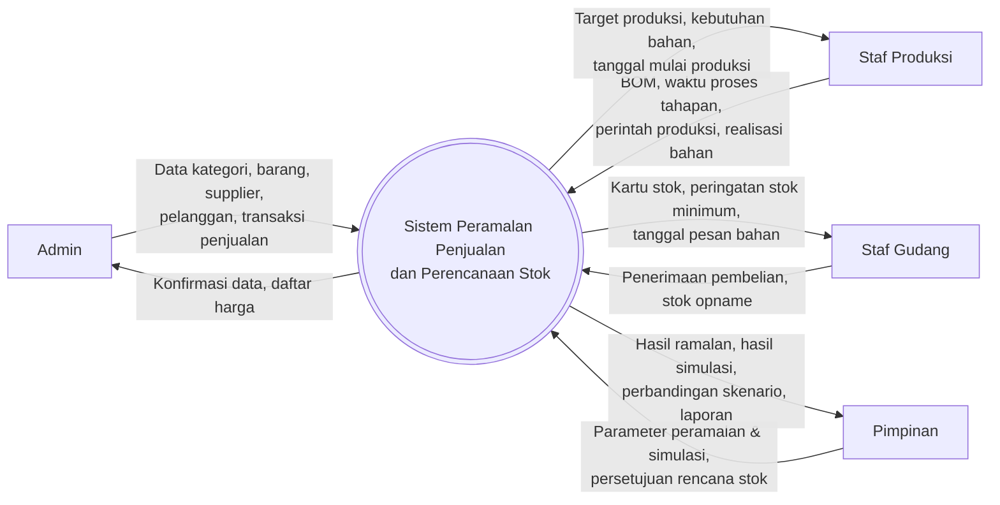

# Alur Kerja Sistem

**Rancang Bangun Sistem Peramalan Penjualan Barang Berbasis Web Menggunakan Metode Box-Jenkins (ARIMA) untuk Perencanaan Stok**
Studi Kasus: CV. Pande Sejahtera (produsen sekop)

> Dokumen ini sudah disesuaikan dengan **revisi Sidang Proposal**: fokus sistem digeser ke **ketepatan rencana persediaan**, bukan sekadar perhitungan angka peramalan.

---

## 1. Gambaran Umum

CV. Pande Sejahtera adalah **perusahaan manufaktur**, bukan toko. Karena itu sistem tidak berhenti pada "ramalkan penjualan", tetapi meneruskannya menjadi keputusan persediaan yang terukur.

```
Peramalan penjualan sekop (ARIMA)      <- ALAT, bukan tujuan
        |
        v
Rincian waktu tunggu operasional pabrik <- kapan harus mulai beli & produksi
        |
        v
Rencana stok bulanan / Target Produksi  <- perencanaan stok BARANG JADI
        |
        v  (ledak BOM)
Kebutuhan bahan baku                    <- perencanaan stok BAHAN BAKU
        |
        v
Simulasi dengan data masa lalu          <- TOLAK UKUR KEBERHASILAN
```

### 1.1 Pergeseran Fokus Sesuai Revisi Sidang

| Aspek | Sebelum revisi | Setelah revisi |
|---|---|---|
| Tujuan utama | Menghasilkan angka ramalan yang akurat | Menghasilkan **rencana persediaan yang tepat** |
| Ukuran keberhasilan | MAPE peramalan | **Simulasi rencana stok**: berkurangnya barang menumpuk & batalnya pesanan |
| Peran ARIMA | Inti sistem | Alat bantu untuk menyusun rencana stok |
| Waktu tunggu | Satu angka `lead_time` | **Dirinci**: lama beli bahan + lama tiap tahapan produksi |
| Bukti di laporan | Tabel perhitungan Box-Jenkins | Tabel perhitungan **+ tabel perbandingan skenario** |

MAPE tetap dihitung dan dilaporkan, tetapi kedudukannya menjadi *ukuran kualitas alat*, bukan ukuran keberhasilan sistem.

### 1.2 Aktor Sistem

| Aktor | Hak Akses |
|---|---|
| **Admin** | Seluruh master data (kategori, barang, supplier, pelanggan), kelola pengguna, seluruh transaksi |
| **Staf Produksi** | BOM, perintah produksi 5 tahapan, realisasi pemakaian bahan |
| **Staf Gudang** | Persediaan, mutasi stok, penerimaan pembelian, stok opname |
| **Pimpinan** | Menjalankan peramalan & simulasi, menyetujui target produksi, seluruh laporan |

### 1.3 Klasifikasi Barang

Semua item disimpan dalam satu tabel `barang`, dibedakan kolom `jenis_barang`:

| Jenis | Contoh | Peran |
|---|---|---|
| `bahan_baku` | Plat besi, kayu gagang, cat coating, kawat las, plastik kemasan | Dibeli dari supplier, dikonsumsi produksi |
| `setengah_jadi` | Kepala sekop mentah, kepala ter-coating, handle jadi, sekop rakitan | Output tahapan antara, sekaligus input tahapan berikutnya |
| `barang_jadi` | Sekop siap jual (sudah dikemas) | Dijual ke pelanggan, **penjualannya yang diramalkan ARIMA** |

### 1.4 Batasan Sistem

- Data time series minimal **36 periode (3 tahun bulanan)** per barang jadi: 24 periode untuk pembentukan model, 12 periode untuk simulasi pengujian.
- Satu proses peramalan berlaku untuk **satu barang jadi** (univariate ARIMA).
- Periode agregasi: **bulanan**.

---

## 2. Alur Kerja Utama



---

## 3. Alur Proses Produksi Sekop

Lima tahapan berjalan berantai. Output satu tahap menjadi input tahap berikutnya, dan setiap tahap punya BOM serta **waktu proses** sendiri.



### 3.1 Yang Terjadi di Database Saat Satu Perintah Produksi Selesai



---

## 4. Rincian Waktu Tunggu Operasional Pabrik

**Tuntutan revisi:** rencana stok tidak boleh mengabaikan berapa lama perusahaan sebenarnya butuh waktu untuk mengubah bahan baku menjadi barang jadi siap jual.

### 4.1 Komponen Waktu Tunggu



| Komponen | Sumber data | Keterangan |
|---|---|---|
| `L_beli` | `barang.lead_time_hari` pada bahan baku | Diambil **nilai terbesar** dari seluruh bahan dalam BOM, karena pembelian dilakukan serentak; yang menentukan adalah bahan paling lama datang |
| `t1..t5` | `tahapan_produksi.waktu_proses_hari` | Lama pengerjaan tiap tahapan |
| kapasitas | `tahapan_produksi.kapasitas_per_hari` | Bila target melebihi kapasitas harian, tahapan itu memakan hari tambahan |

### 4.2 Rumus

```
Hari tahapan-i   = waktu_proses_hari_i + ( CEIL(target / kapasitas_per_hari_i) - 1 )
                   ; bila kapasitas_per_hari_i = 0, bagian kapasitas diabaikan

L_produksi       = SUM( Hari tahapan-i )  untuk seluruh tahapan pada rantai BOM
L_beli           = MAX( lead_time_hari )  dari seluruh bahan baku pada rantai BOM
L_total          = L_beli + L_produksi

Tanggal mulai produksi = awal periode penjualan - L_produksi
Tanggal pesan bahan    = Tanggal mulai produksi - L_beli
```

### 4.3 Pengaruh ke Rencana Stok

Karena satuan data adalah bulanan, waktu tunggu diubah ke satuan periode:

```
LT_periode  = L_total / 30
Safety Stock = Z x sigma_error x sqrt(LT_periode)
```

**Konsekuensi penting:** bila `L_total > 30 hari`, maka perintah produksi untuk bulan depan **harus sudah dibuat bulan ini**. Sistem menampilkan peringatan berisi tanggal paling lambat pemesanan bahan dan tanggal mulai produksi, disimpan pada `target_produksi.tanggal_pesan_bahan` dan `tanggal_mulai_produksi`.

Inilah jawaban langsung atas revisi: waktu tunggu bukan angka pelengkap, tapi **patokan rencana stok bulanan**.

---

## 5. Alur Detail Proses Box-Jenkins

Empat tahap Box-Jenkins diimplementasikan sebagai pipeline yang setiap langkahnya **tercatat di database**, sehingga dapat ditampilkan kembali sebagai bukti perhitungan pada laporan.

Sumber data: `SUM(detail_penjualan.jumlah)` per bulan untuk satu barang jadi, disimpan ke `data_time_series` sebagai deret Zt.



### 5.1 Rumus yang Diimplementasikan

```
phi(B) (1 - B)^d Z_t = theta(B) a_t

phi(B)   = 1 - phi_1 B - phi_2 B^2 - ... - phi_p B^p        (komponen AR)
theta(B) = 1 - theta_1 B - theta_2 B^2 - ... - theta_q B^q  (komponen MA)
```

| Perhitungan | Rumus |
|---|---|
| Differencing ordo 1 | `W_t = Z_t - Z_(t-1)` |
| ACF lag-k | `r_k = SUM (Z_t - Zbar)(Z_(t+k) - Zbar) / SUM (Z_t - Zbar)^2` |
| PACF | Rekursi Durbin-Levinson dari nilai ACF |
| Batas signifikansi | `+/- 1.96 / sqrt(n)` |
| Uji ADF | `dZ_t = alpha + beta*t + gamma*Z_(t-1) + SUM delta_i dZ_(t-i) + e_t`, uji `gamma = 0` |
| AIC | `AIC = n * ln(sigma^2) + 2k` |
| BIC | `BIC = n * ln(sigma^2) + k * ln(n)` |
| Ljung-Box | `Q = n(n+2) * SUM (r_k^2 / (n-k))`, bandingkan chi-square(m-p-q) |
| MAPE | `(100/n) * SUM abs(Y_t - Yhat_t) / Y_t` |
| RMSE | `sqrt( (1/n) * SUM (Y_t - Yhat_t)^2 )` |
| MAE | `(1/n) * SUM abs(Y_t - Yhat_t)` |
| Interval kepercayaan | `Yhat_(t+h) +/- Z_(alpha/2) * sigma * sqrt(SUM psi_j^2)` |

**Interpretasi MAPE** (kualitas alat peramalan, bukan keberhasilan sistem):

| MAPE | Kategori |
|---|---|
| < 10% | Sangat Baik |
| 10% - 20% | Baik |
| 20% - 50% | Cukup |
| > 50% | Buruk |

---

## 6. Alur Rencana Stok / Target Produksi

Menu: **Peramalan > Target Produksi**.



### 6.1 Rumus Perencanaan Stok

```
sigma_e            = standar deviasi error peramalan (dari residual in-sample)
LT_periode         = L_total / 30
Safety Stock (SS)  = Z * sigma_e * sqrt(LT_periode)    ; Z = 1.65 untuk service level 95%
Reorder Point      = (rata-rata permintaan harian * L_total) + SS

Target Produksi    = Prediksi Penjualan + SS
                     - Stok Barang Jadi - Stok Setengah Jadi Siap Rakit

Kebutuhan Bahan-i  = Target Produksi
                     x (detail_bom.jumlah_kebutuhan / bom.jumlah_output)
                     x (1 + persen_susut / 100)

Kekurangan Bahan-i = Kebutuhan Bahan-i - Stok Tersedia Bahan-i
Qty Rekomendasi    = Kekurangan + Safety Stock bahan   (bila kekurangan > 0)
```

---

## 7. Pengujian Rencana Stok dengan Simulasi Data Masa Lalu

**Ini tolak ukur utama keberhasilan sistem menurut revisi sidang.**

Gagasannya: putar ulang data penjualan masa lalu perusahaan, lalu jalankan dua skenario berdampingan pada periode yang sama. Bila rekomendasi sistem benar-benar berguna, ia harus menghasilkan lebih sedikit barang menumpuk **dan** lebih sedikit pesanan batal dibanding kebijakan yang selama ini dipakai.

### 7.1 Rancangan Pengujian



### 7.2 Mekanisme Simulasi per Bulan

Untuk setiap bulan `t` pada periode simulasi, tiap skenario dijalankan dengan aturan yang sama persis — yang berbeda **hanya cara menentukan `rencana_produksi`**:

```
barang_masuk(t)   = rencana_produksi( t - CEIL(L_total / 30) )
                    <- hasil produksi baru tiba setelah waktu tunggu terlewati

tersedia(t)       = stok_awal(t) + barang_masuk(t)
terpenuhi(t)      = MIN( permintaan_aktual(t), tersedia(t) )
stockout_unit(t)  = permintaan_aktual(t) - terpenuhi(t)     <- pesanan batal
stok_akhir(t)     = tersedia(t) - terpenuhi(t)
overstock_unit(t) = MAX( 0, stok_akhir(t) - permintaan_aktual(t+1) )   <- barang menumpuk

biaya_simpan(t)   = stok_akhir(t)    x biaya_simpan_per_unit
biaya_stockout(t) = stockout_unit(t) x biaya_stockout_per_unit
```

**Penentuan `rencana_produksi` per skenario:**

| Skenario | Cara menentukan |
|---|---|
| Perusahaan — `produksi_aktual` | Memakai angka produksi asli perusahaan bila datanya tersedia |
| Perusahaan — `naif_bulan_lalu` | `rencana_produksi(t) = permintaan_aktual(t-1)` |
| Perusahaan — `rata_rata_bergerak` | Rata-rata 3 bulan terakhir |
| **Sistem** | `SUM( forecast(t) .. forecast(t + CEIL(L_total/30)) ) + SS - stok_awal(t) - barang dalam proses` |

> **Revisi (2026-09-21):** rumus di atas menetralkan permintaan **sepanjang waktu tunggu**
> (`CEIL(L_total/30) + 1` bulan ke depan), bukan cuma `forecast(t)` satu bulan. Lihat
> alasan revisi di §7.5 poin 4.

### 7.3 Metrik Perbandingan

| Metrik | Rumus | Arah baik |
|---|---|---|
| Total unit stockout | `SUM stockout_unit` | Makin kecil |
| Jumlah bulan stockout | `COUNT( stockout_unit > 0 )` | Makin kecil |
| Service level tercapai | `SUM terpenuhi / SUM permintaan x 100` | Makin besar |
| Rata-rata stok akhir | `AVG stok_akhir` | Makin kecil (tanpa menaikkan stockout) |
| Total overstock | `SUM overstock_unit` | Makin kecil |
| Perputaran persediaan | `SUM permintaan / AVG stok_akhir` | Makin besar |
| Total biaya | `SUM biaya_simpan + SUM biaya_stockout` | Makin kecil |

### 7.4 Kesimpulan Otomatis

```
penurunan_overstock_persen = (pb_total_overstock - sis_total_overstock) / pb_total_overstock x 100
penurunan_stockout_persen  = (pb_total_stockout  - sis_total_stockout)  / pb_total_stockout  x 100
penghematan_biaya          = pb_total_biaya - sis_total_biaya

is_sistem_lebih_baik = (sis_total_overstock <= pb_total_overstock)
                       AND (sis_total_stockout <= pb_total_stockout)
```

Sistem menuliskan kalimat kesimpulan otomatis, contoh:

> Pada simulasi 12 bulan (Okt 2025 - Sep 2026), rekomendasi sistem menurunkan kelebihan stok sebesar **38,4%** (dari 1.240 unit menjadi 764 unit) dan menurunkan pesanan yang batal sebesar **71,2%** (dari 320 unit menjadi 92 unit), dengan service level naik dari 87,1% menjadi 96,4%.

Kalimat inilah yang menjawab permintaan penguji: *"membuktikan bahwa saran dari sistem secara nyata mampu mengurangi jumlah barang yang menumpuk dan mencegah batalnya pesanan akibat stok kosong."*

### 7.5 Catatan Kejujuran Metodologi

Agar simulasi tidak dituduh mengada-ada saat sidang:

1. Model ARIMA dibentuk **hanya** dari 24 bulan pertama. Data 12 bulan terakhir tidak pernah dilihat model saat pembentukan.
2. Kedua skenario memakai stok awal, permintaan aktual, dan waktu tunggu yang **sama persis**. Yang berbeda hanya cara menentukan jumlah produksi.
3. Seluruh baris perhitungan bulanan disimpan di `simulasi_detail` dan dapat dicetak sebagai lampiran, sehingga penguji bisa menelusuri angkanya satu per satu.
4. **Revisi rumus skenario Sistem (2026-09-21).** Rumus awal (`forecast(t) + SS - stok_awal(t) - barang dalam proses`) hanya menetralkan permintaan satu bulan. Saat diuji dengan data penjualan asli yang waktu tunggunya lebih dari satu bulan, rumus ini menghasilkan pola pemesanan naik-turun tidak stabil (satu bulan pesan besar, bulan berikutnya tidak pesan sama sekali karena mengira kiriman yang sedang berjalan sudah cukup) sehingga skenario Sistem justru tampak lebih buruk daripada kebijakan lama perusahaan. Ini bukan karena implementasinya salah, tapi karena rumusnya belum memperhitungkan bahwa satu kali pesan harus menutupi seluruh rentang waktu tunggu, bukan cuma satu bulan.

   Rumus diperbaiki menjadi menetralkan **total permintaan sepanjang waktu tunggu** (`CEIL(L_total/30) + 1` bulan ke depan, bukan cuma `forecast(t)`). Ini bukan rumus baru: bila `L_total <= 30 hari` (waktu tunggu satu bulan atau kurang), rumus revisi ini kembali persis sama dengan rumus awal, jadi rumus awal adalah kasus khusus dari rumus revisi ini.

---

## 8. Diagram Konteks (DFD Level 0)



---

## 9. Struktur Menu Aplikasi

```
Dashboard
|   Ringkasan stok, grafik tren penjualan, aktivitas terbaru
|
|-- Master Data
|   |-- Data Kategori
|   |-- Data Barang            (bahan baku / setengah jadi / barang jadi)
|   |-- Data Supplier
|   |-- Data Pelanggan
|   |-- Tahapan Produksi       (waktu proses & kapasitas tiap tahapan)
|
|-- Transaksi & Operasional
|   |-- Pembelian
|   |   |-- Transaksi Pembelian
|   |   |-- Riwayat Pembelian Bahan
|   |-- Produksi
|   |   |-- BOM / Komposisi
|   |   |-- Produksi Kepala
|   |   |-- Produksi Handle
|   |   |-- Proses Coating
|   |   |-- Perakitan Sekop
|   |   |-- Proses Pengemasan
|   |-- Persediaan
|   |   |-- Stok Saat Ini
|   |   |-- Mutasi Stok
|   |-- Penjualan
|       |-- Transaksi Penjualan
|
|-- Analisis & Laporan
    |-- Peramalan (ARIMA)
    |   |-- Data Historis        -> agregasi penjualan jadi deret Zt
    |   |-- Proses Forecasting   -> 4 tahap Box-Jenkins
    |   |-- Waktu Tunggu         -> rincian lead time beli + produksi
    |   |-- Target Produksi      -> rencana stok + kebutuhan bahan
    |-- Simulasi & Pengujian     -> UJI RENCANA STOK DENGAN DATA MASA LALU
    |   |-- Jalankan Simulasi
    |   |-- Perbandingan Skenario
    |   |-- Rincian Bulanan
    |-- Laporan
        |-- Laporan Pembelian
        |-- Laporan Produksi
        |-- Laporan Persediaan
        |-- Laporan Penjualan
        |-- Laporan Hasil Simulasi
```

**Catatan implementasi menu produksi:** lima menu tahapan memakai **satu controller dan satu tabel `produksi`**, dibedakan `tahapan_id`. Menambah atau mengubah tahapan cukup lewat master `tahapan_produksi`.

---

## 10. Hak Akses per Menu

| Menu | Admin | Produksi | Gudang | Pimpinan |
|---|:---:|:---:|:---:|:---:|
| Dashboard | v | v | v | v |
| Master Data | v | - | lihat | lihat |
| Tahapan Produksi | v | v | - | lihat |
| Pembelian | v | - | v | lihat |
| BOM / Komposisi | v | v | - | lihat |
| Produksi (5 tahap) | v | v | lihat | lihat |
| Persediaan & Mutasi Stok | v | lihat | v | lihat |
| Penjualan | v | - | - | lihat |
| Peramalan & Target Produksi | lihat | lihat | - | v |
| **Simulasi & Pengujian** | lihat | - | - | v |
| Laporan | v | v | v | v |

---

## 11. Rancangan Teknis

| Lapisan | Implementasi |
|---|---|
| Framework | Laravel 12.69 (PHP 8.2) |
| Database | MySQL - `db_peramalan_pande` |
| Auth & Role | Laravel Breeze (Blade) + middleware role |
| UI | Blade + Tailwind CSS |
| Grafik | Chart.js - time series, correlogram ACF/PACF, aktual vs prediksi, perbandingan skenario simulasi |
| Import Excel | `maatwebsite/excel` |
| Export PDF | `barryvdh/laravel-dompdf` |
| Perhitungan ARIMA & simulasi | **Service class PHP murni**, tanpa library statistik eksternal |

**Service class yang akan dibuat:**

```
app/Services/
|-- Arima/
|   |-- TimeSeriesBuilder.php      agregasi penjualan -> deret Zt
|   |-- StationarityTest.php       uji ADF + differencing
|   |-- AutoCorrelation.php        ACF, PACF (Durbin-Levinson)
|   |-- ArimaEstimator.php         estimasi koefisien, AIC, BIC, uji t
|   |-- DiagnosticChecker.php      Ljung-Box + normalitas residual
|   |-- Forecaster.php             forecast h-step + interval kepercayaan
|   |-- AccuracyMetric.php         MAPE, RMSE, MAE
|   |-- BoxJenkinsPipeline.php     orkestrator tahap 1-4
|-- Produksi/
|   |-- BomExploder.php            ledak BOM -> kebutuhan bahan
|   |-- LeadTimeCalculator.php     L_beli + L_produksi + tanggal mulai
|   |-- ProduksiProcessor.php      eksekusi perintah produksi + mutasi stok
|-- Stok/
|   |-- StockMutator.php           pencatatan mutasi stok terpusat
|   |-- TargetProduksiPlanner.php  Safety Stock, ROP, target produksi
|-- Simulasi/
    |-- SimulationRunner.php       orkestrator backtesting
    |-- KebijakanPerusahaan.php    skenario pembanding
    |-- KebijakanSistem.php        skenario rekomendasi sistem
    |-- SimulationMetric.php       stockout, overstock, service level, biaya
```

---

## 12. Rencana Hosting

Revisi mewajibkan web sudah dihosting. Kebutuhan minimum:

| Kebutuhan | Spesifikasi |
|---|---|
| PHP | 8.2 atau lebih baru, ekstensi: `bcmath`, `mbstring`, `pdo_mysql`, `zip`, `gd` |
| Database | MySQL 5.7+ / MariaDB 10.3+ |
| Composer | Wajib bisa dijalankan, atau `vendor/` di-upload manual |
| Document root | Harus diarahkan ke folder `public/` |
| Penyimpanan | Minimal 1 GB (termasuk `vendor/` dan `node_modules` tidak perlu ikut di-upload) |

Langkah deploy yang akan dilakukan:

1. Build aset di lokal (`npm run build`) lalu upload folder `public/build`
2. Upload source tanpa `node_modules/`
3. Buat database di hosting, import struktur lewat `php artisan migrate --force`
4. Sesuaikan `.env` produksi: `APP_ENV=production`, `APP_DEBUG=false`, `APP_KEY`, kredensial database
5. `php artisan config:cache` + `route:cache` + `view:cache`
6. Pastikan `storage/` dan `bootstrap/cache/` dapat ditulis
