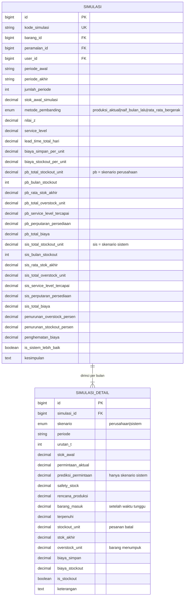

# Entity Relationship Diagram (ERD)

**Rancang Bangun Sistem Peramalan Penjualan Barang Berbasis Web Menggunakan Metode Box-Jenkins (ARIMA) untuk Perencanaan Stok**
Studi Kasus: CV. Pande Sejahtera (produsen sekop)

> Sudah disesuaikan dengan **revisi Sidang Proposal**: penambahan rincian waktu tunggu operasional pabrik dan modul simulasi pengujian rencana stok.

Database: `db_peramalan_pande` (MySQL, InnoDB, utf8mb4)
Status: **seluruh migration sudah dijalankan dan tervalidasi**

---

## 1. Daftar Entitas (27 tabel)

| No | Tabel | Kelompok | Fungsi |
|---|---|---|---|
| 1 | `users` | Master | Pengguna sistem + role (admin, produksi, gudang, pimpinan) |
| 2 | `kategori` | Master | Pengelompokan barang |
| 3 | `supplier` | Master | Pemasok bahan baku |
| 4 | `pelanggan` | Master | Pembeli sekop (toko, distributor, perorangan, instansi) |
| 5 | `barang` | Master | Seluruh item: bahan baku, setengah jadi, barang jadi |
| 6 | `tahapan_produksi` | Produksi | Master 5 tahapan berurutan |
| 7 | `bom` | Produksi | Header resep/komposisi per item output |
| 8 | `detail_bom` | Produksi | Komponen penyusun BOM (yang diledakkan) |
| 9 | `pembelian` | Transaksi | Header order pembelian ke supplier |
| 10 | `detail_pembelian` | Transaksi | Item per order pembelian |
| 11 | `produksi` | Transaksi | Perintah kerja pada satu tahapan |
| 12 | `detail_produksi_bahan` | Transaksi | Bahan yang dikonsumsi perintah produksi |
| 13 | `penjualan` | Transaksi | Header faktur penjualan |
| 14 | `detail_penjualan` | Transaksi | Item per faktur -- **sumber data time series** |
| 15 | `mutasi_stok` | Persediaan | Seluruh pergerakan stok masuk/keluar/penyesuaian |
| 16 | `data_time_series` | Peramalan | Hasil agregasi penjualan bulanan (deret Zt) |
| 17 | `peramalan` | Peramalan | Header proses peramalan + model terpilih + akurasi |
| 18 | `uji_stasioneritas` | Peramalan | Hasil uji ADF tiap tingkat differencing |
| 19 | `korelasi_lag` | Peramalan | Nilai ACF & PACF per lag |
| 20 | `kandidat_model` | Peramalan | Semua ARIMA(p,d,q) hasil grid search + AIC/BIC |
| 21 | `parameter_model` | Peramalan | Koefisien AR/MA/konstanta + uji t |
| 22 | `hasil_peramalan` | Peramalan | Aktual, prediksi, residual, interval per periode |
| 23 | `target_produksi` | Perencanaan | Safety stock + jumlah yang harus diproduksi |
| 24 | `kebutuhan_bahan` | Perencanaan | Hasil BOM explosion + rekomendasi pembelian |
| 25 | `simulasi` | **Pengujian** | Header backtesting rencana stok + ringkasan kedua skenario |
| 26 | `simulasi_detail` | **Pengujian** | Jejak simulasi bulan per bulan tiap skenario |
| 27 | `log_aktivitas` | Pendukung | Jejak audit aktivitas pengguna |

Tabel bawaan framework (`sessions`, `password_reset_tokens`, `cache`, `jobs`) tidak digambarkan karena bukan bagian dari domain masalah.

---

## 2. Diagram ERD

### 2.1 ERD Keseluruhan (relasi antar entitas)

```mermaid
erDiagram
    USERS ||--o{ PEMBELIAN : "menginput"
    USERS ||--o{ PRODUKSI : "menjalankan"
    USERS ||--o{ PENJUALAN : "menginput"
    USERS ||--o{ MUTASI_STOK : "mencatat"
    USERS ||--o{ PERAMALAN : "memproses"
    USERS ||--o{ TARGET_PRODUKSI : "menyetujui"
    USERS ||--o{ LOG_AKTIVITAS : "menghasilkan"

    KATEGORI ||--o{ BARANG : "mengelompokkan"
    SUPPLIER ||--o{ BARANG : "memasok"
    SUPPLIER ||--o{ PEMBELIAN : "menerima order"
    PELANGGAN ||--o{ PENJUALAN : "melakukan"

    BARANG ||--o{ BOM : "dihasilkan oleh"
    BARANG ||--o{ DETAIL_BOM : "menjadi komponen"
    TAHAPAN_PRODUKSI ||--o{ BOM : "dipakai pada"
    BOM ||--|{ DETAIL_BOM : "terdiri atas"

    PEMBELIAN ||--|{ DETAIL_PEMBELIAN : "memiliki"
    BARANG ||--o{ DETAIL_PEMBELIAN : "dibeli pada"

    TAHAPAN_PRODUKSI ||--o{ PRODUKSI : "mengatur"
    BOM ||--o{ PRODUKSI : "menjadi acuan"
    BARANG ||--o{ PRODUKSI : "sebagai output"
    PRODUKSI ||--|{ DETAIL_PRODUKSI_BAHAN : "mengonsumsi"
    BARANG ||--o{ DETAIL_PRODUKSI_BAHAN : "dipakai pada"

    PENJUALAN ||--|{ DETAIL_PENJUALAN : "memiliki"
    BARANG ||--o{ DETAIL_PENJUALAN : "dijual pada"

    BARANG ||--o{ MUTASI_STOK : "dimutasi pada"
    BARANG ||--o{ DATA_TIME_SERIES : "diagregasi menjadi"
    BARANG ||--o{ PERAMALAN : "diramalkan pada"

    PERAMALAN ||--|{ UJI_STASIONERITAS : "menghasilkan"
    PERAMALAN ||--|{ KORELASI_LAG : "menghasilkan"
    PERAMALAN ||--|{ KANDIDAT_MODEL : "menguji"
    PERAMALAN ||--|{ PARAMETER_MODEL : "memiliki"
    PERAMALAN ||--|{ HASIL_PERAMALAN : "menghasilkan"

    PERAMALAN ||--o{ TARGET_PRODUKSI : "menjadi dasar"
    BARANG ||--o{ TARGET_PRODUKSI : "direncanakan"
    TARGET_PRODUKSI ||--|{ KEBUTUHAN_BAHAN : "diledakkan menjadi"
    BARANG ||--o{ KEBUTUHAN_BAHAN : "dibutuhkan sebagai"
    TAHAPAN_PRODUKSI ||--o{ KEBUTUHAN_BAHAN : "pada tahapan"

    BARANG ||--o{ SIMULASI : "diuji rencana stoknya"
    PERAMALAN ||--o{ SIMULASI : "menjadi dasar skenario sistem"
    USERS ||--o{ SIMULASI : "menjalankan"
    SIMULASI ||--|{ SIMULASI_DETAIL : "dirinci per bulan"
```



### 2.2 Atribut Kelompok Master & Produksi

```mermaid
erDiagram
    USERS {
        bigint id PK
        string name
        string email UK
        string password
        enum role "admin|produksi|gudang|pimpinan"
        boolean is_aktif
    }

    KATEGORI {
        bigint id PK
        string kode_kategori UK
        string nama_kategori
        text keterangan
    }

    SUPPLIER {
        bigint id PK
        string kode_supplier UK
        string nama_supplier
        string telepon
        string email
        text alamat
        smallint lead_time_default
        boolean is_aktif
    }

    PELANGGAN {
        bigint id PK
        string kode_pelanggan UK
        string nama_pelanggan
        enum jenis "toko|distributor|perorangan|instansi"
        string telepon
        string email
        text alamat
        string kota
        boolean is_aktif
    }

    BARANG {
        bigint id PK
        string kode_barang UK
        string nama_barang
        enum jenis_barang "bahan_baku|setengah_jadi|barang_jadi"
        bigint kategori_id FK
        bigint supplier_id FK
        string satuan
        decimal harga_beli
        decimal harga_jual
        int stok_tersedia
        int stok_minimum
        smallint lead_time_hari
        decimal service_level
        boolean is_diramalkan
        boolean is_aktif
    }

    TAHAPAN_PRODUKSI {
        bigint id PK
        string kode_tahapan UK
        string nama_tahapan
        tinyint urutan
        decimal waktu_proses_hari "lama pengerjaan tahapan"
        decimal kapasitas_per_hari "unit per hari"
        text deskripsi
        boolean is_aktif
    }

    BOM {
        bigint id PK
        string kode_bom UK
        string nama_bom
        bigint barang_id FK "item output"
        bigint tahapan_id FK
        decimal jumlah_output
        boolean is_aktif
        text keterangan
    }

    DETAIL_BOM {
        bigint id PK
        bigint bom_id FK
        bigint barang_id FK "komponen"
        decimal jumlah_kebutuhan
        string satuan
        decimal persen_susut
        text keterangan
    }
```



### 2.3 Atribut Kelompok Transaksi & Persediaan

```mermaid
erDiagram
    PEMBELIAN {
        bigint id PK
        string no_pembelian UK
        date tanggal_pembelian
        date tanggal_terima
        bigint supplier_id FK
        bigint user_id FK
        decimal total_harga
        enum status "dipesan|diterima|batal"
        enum sumber_data "manual|import"
        text keterangan
    }

    DETAIL_PEMBELIAN {
        bigint id PK
        bigint pembelian_id FK
        bigint barang_id FK
        int jumlah
        decimal harga_satuan
        decimal subtotal
    }

    PRODUKSI {
        bigint id PK
        string no_produksi UK
        date tanggal_produksi
        bigint tahapan_id FK
        bigint bom_id FK
        bigint barang_output_id FK
        decimal jumlah_target
        decimal jumlah_hasil
        decimal jumlah_gagal
        enum status "draft|proses|selesai|batal"
        bigint user_id FK
        text keterangan
    }

    DETAIL_PRODUKSI_BAHAN {
        bigint id PK
        bigint produksi_id FK
        bigint barang_id FK
        decimal jumlah_rencana "dari BOM"
        decimal jumlah_pakai "realisasi"
        string satuan
        text keterangan
    }

    PENJUALAN {
        bigint id PK
        string no_faktur UK
        date tanggal_penjualan
        bigint pelanggan_id FK
        bigint user_id FK
        string nama_pelanggan_manual
        decimal total_harga
        enum sumber_data "manual|import"
        text keterangan
    }

    DETAIL_PENJUALAN {
        bigint id PK
        bigint penjualan_id FK
        bigint barang_id FK
        int jumlah
        decimal harga_satuan
        decimal subtotal
    }

    MUTASI_STOK {
        bigint id PK
        bigint barang_id FK
        date tanggal
        enum jenis_mutasi "masuk|keluar|penyesuaian"
        enum sumber "pembelian|produksi|penjualan|opname|lainnya"
        string referensi_tipe
        bigint referensi_id
        decimal jumlah
        decimal stok_awal
        decimal stok_akhir
        bigint user_id FK
        text keterangan
    }
```



### 2.4 Atribut Kelompok Peramalan & Perencanaan

```mermaid
erDiagram
    DATA_TIME_SERIES {
        bigint id PK
        bigint barang_id FK
        string periode "YYYY-MM"
        smallint tahun
        tinyint bulan
        int urutan_t "t = 1..n"
        decimal nilai_zt
        timestamp dihitung_pada
    }

    PERAMALAN {
        bigint id PK
        string kode_peramalan UK
        bigint barang_id FK
        bigint user_id FK
        string periode_awal
        string periode_akhir
        int jumlah_data
        tinyint ordo_p
        tinyint ordo_d
        tinyint ordo_q
        decimal konstanta
        decimal aic
        decimal bic
        decimal sigma_kuadrat
        decimal mape
        decimal rmse
        decimal mae
        string kategori_akurasi
        tinyint horizon
        enum status "draft|final|ditolak"
        text catatan
    }

    UJI_STASIONERITAS {
        bigint id PK
        bigint peramalan_id FK
        tinyint differencing_ke "0 = data asli"
        decimal rata_rata
        decimal standar_deviasi
        decimal adf_statistic
        decimal nilai_kritis_1
        decimal nilai_kritis_5
        decimal nilai_kritis_10
        decimal p_value
        boolean is_stasioner
        text kesimpulan
    }

    KORELASI_LAG {
        bigint id PK
        bigint peramalan_id FK
        enum jenis "ACF|PACF"
        smallint lag
        decimal nilai
        decimal batas_atas
        decimal batas_bawah
        boolean is_signifikan
    }

    KANDIDAT_MODEL {
        bigint id PK
        bigint peramalan_id FK
        tinyint ordo_p
        tinyint ordo_d
        tinyint ordo_q
        decimal aic
        decimal bic
        decimal sse
        decimal sigma_kuadrat
        decimal mape
        boolean semua_signifikan
        boolean lolos_ljung_box
        boolean is_terpilih
        string keterangan
    }

    PARAMETER_MODEL {
        bigint id PK
        bigint peramalan_id FK
        enum jenis "AR|MA|KONSTANTA"
        tinyint lag
        decimal koefisien
        decimal standard_error
        decimal t_hitung
        decimal t_tabel
        decimal p_value
        boolean is_signifikan
    }

    HASIL_PERAMALAN {
        bigint id PK
        bigint peramalan_id FK
        string periode
        int urutan_t
        enum tipe "in_sample|forecast"
        decimal nilai_aktual
        decimal nilai_prediksi
        decimal residual
        decimal persen_error
        decimal batas_bawah
        decimal batas_atas
    }

    TARGET_PRODUKSI {
        bigint id PK
        bigint peramalan_id FK
        bigint barang_id FK
        bigint user_id FK
        string periode
        decimal prediksi_penjualan
        decimal stok_barang_jadi
        decimal stok_setengah_jadi
        decimal standar_deviasi_error
        decimal lead_time_pembelian_hari
        decimal lead_time_produksi_hari
        decimal lead_time_total_hari
        date tanggal_mulai_produksi
        date tanggal_pesan_bahan
        decimal nilai_z
        decimal safety_stock
        decimal reorder_point
        decimal jumlah_target_produksi
        enum status_stok "aman|segera_produksi|kritis"
        enum status_approval "menunggu|disetujui|ditolak"
        timestamp disetujui_pada
        text catatan
    }

    KEBUTUHAN_BAHAN {
        bigint id PK
        bigint target_produksi_id FK
        bigint barang_id FK
        bigint tahapan_id FK
        decimal jumlah_kebutuhan
        decimal stok_tersedia
        decimal kekurangan
        decimal safety_stock_bahan
        decimal qty_rekomendasi_beli
        string satuan
        enum status "cukup|perlu_beli|mendesak"
        text catatan
    }

    LOG_AKTIVITAS {
        bigint id PK
        bigint user_id FK
        string modul
        string aktivitas
        string ip_address
        timestamp created_at
    }
```



---

### 2.5 Atribut Kelompok Pengujian (Simulasi)

Dua tabel ini adalah jawaban atas revisi sidang: *"rencana stok sistem ini wajib diuji dengan cara disimulasikan menggunakan data masa lalu perusahaan."*



**Kenapa ringkasan kedua skenario disimpan berdampingan di satu baris `simulasi`?**
Karena yang dilaporkan ke penguji adalah *perbandingannya*, bukan angka masing-masing skenario secara terpisah. Dengan struktur ini, satu baris `simulasi` sudah langsung bisa dicetak menjadi tabel perbandingan di bab pengujian, dan kolom `kesimpulan` menyimpan kalimat hasil analisis yang dihasilkan sistem.

---

## 3. Penjelasan Relasi dan Kardinalitas

| Relasi | Kardinalitas | Penjelasan |
|---|---|---|
| `kategori` - `barang` | 1 : N | Satu kategori memiliki banyak barang |
| `supplier` - `barang` | 1 : N | Supplier utama per bahan baku |
| `pelanggan` - `penjualan` | 1 : N | Satu pelanggan bisa punya banyak faktur |
| `barang` - `bom` | 1 : N | Satu item output bisa punya beberapa versi resep |
| `bom` - `detail_bom` | 1 : N (identifying) | Satu BOM wajib punya minimal satu komponen |
| `barang` - `detail_bom` | 1 : N | Satu bahan dipakai di banyak BOM |
| `tahapan_produksi` - `bom` | 1 : N | Tiap resep melekat pada satu tahapan |
| `tahapan_produksi` - `produksi` | 1 : N | Membedakan perintah kerja Kepala / Handle / Coating / Perakitan / Pengemasan |
| `produksi` - `detail_produksi_bahan` | 1 : N (identifying) | Bahan yang dikonsumsi satu perintah kerja |
| `pembelian` - `detail_pembelian` | 1 : N (identifying) | Satu order berisi minimal satu bahan |
| `penjualan` - `detail_penjualan` | 1 : N (identifying) | Satu faktur berisi minimal satu barang jadi |
| `barang` - `mutasi_stok` | 1 : N | Seluruh pergerakan stok per item |
| `barang` - `data_time_series` | 1 : N | Deret Zt per barang jadi |
| `barang` - `peramalan` | 1 : N | Satu barang bisa diramalkan berkali-kali (riwayat) |
| `peramalan` - 5 tabel tahapan | 1 : N | `uji_stasioneritas`, `korelasi_lag`, `kandidat_model`, `parameter_model`, `hasil_peramalan` |
| `peramalan` - `target_produksi` | 1 : N | Satu peramalan bisa direncanakan untuk beberapa periode |
| `target_produksi` - `kebutuhan_bahan` | 1 : N (identifying) | Hasil ledak BOM per target |
| `barang` - `simulasi` | 1 : N | Satu barang jadi bisa diuji berkali-kali dengan parameter berbeda |
| `peramalan` - `simulasi` | 1 : N | Model ARIMA yang dipakai skenario sistem |
| `simulasi` - `simulasi_detail` | 1 : N (identifying) | 2 skenario x jumlah periode; mis. 2 x 12 = 24 baris |

**Relasi N:M yang dipecah menjadi tabel penghubung:**

| Relasi N:M | Tabel penghubung |
|---|---|
| `penjualan` x `barang` | `detail_penjualan` |
| `pembelian` x `barang` | `detail_pembelian` |
| `bom` x `barang` | `detail_bom` |
| `produksi` x `barang` | `detail_produksi_bahan` |
| `target_produksi` x `barang` | `kebutuhan_bahan` |

**Relasi rekursif tersamar:** `barang` berelasi ke dirinya sendiri lewat pasangan `bom.barang_id` (output) dan `detail_bom.barang_id` (komponen). Struktur inilah yang memungkinkan BOM bertingkat: sekop tersusun dari sekop rakitan, yang tersusun dari kepala ter-coating, yang tersusun dari kepala mentah, yang tersusun dari plat besi.

---

## 4. Catatan Normalisasi (3NF)

1. **1NF** — Semua atribut atomik. Daftar barang pada satu nota dan daftar komponen pada satu BOM dipisah ke tabel detail, tidak disimpan sebagai teks gabungan.
2. **2NF** — Tidak ada ketergantungan parsial. Pada `detail_penjualan` dan `detail_pembelian`, `harga_satuan` sengaja disimpan ulang karena harga bersifat **historis** pada saat transaksi terjadi; ini keputusan desain, bukan redundansi.
3. **3NF** — Tidak ada ketergantungan transitif. `nama_kategori` tidak disimpan di `barang`, cukup `kategori_id`.

**Denormalisasi terkendali (disengaja, wajib dijelaskan di laporan):**

| Kolom | Alasan |
|---|---|
| `barang.stok_tersedia` | Ringkasan dari `mutasi_stok`. Disimpan agar cek stok cepat; diperbarui otomatis oleh observer setiap mutasi |
| `mutasi_stok.stok_awal` & `stok_akhir` | Saldo berjalan disimpan agar kartu stok bisa dicetak apa adanya tanpa menghitung ulang seluruh riwayat |
| `data_time_series` | Tabel agregat dari `detail_penjualan`. Disimpan permanen agar hasil peramalan tetap dapat direproduksi walaupun transaksi lama diubah |
| `peramalan.mape` / `rmse` / `mae` | Hasil kalkulasi dari `hasil_peramalan`, disimpan di header agar daftar riwayat peramalan tidak perlu agregasi berat |
| `detail_produksi_bahan.jumlah_rencana` | Salinan dari BOM saat perintah dibuat. Bila BOM diubah kemudian, riwayat produksi lama tetap menunjukkan rencana yang berlaku saat itu |
| `simulasi.pb_*` dan `simulasi.sis_*` | Ringkasan agregat dari `simulasi_detail`. Disimpan berdampingan agar tabel perbandingan skenario di bab pengujian bisa dicetak dari satu baris |
| `simulasi.lead_time_total_hari` | Salinan waktu tunggu saat simulasi dijalankan, supaya hasil pengujian tetap dapat direproduksi walaupun waktu proses tahapan diubah kemudian |

---

## 5. Indeks yang Dipasang

```sql
-- percepat agregasi time series
CREATE INDEX idx_detail_penjualan_barang ON detail_penjualan (barang_id);
CREATE INDEX idx_penjualan_tanggal       ON penjualan (tanggal_penjualan);

-- satu baris per barang per periode
CREATE UNIQUE INDEX uq_timeseries ON data_time_series (barang_id, periode);

-- penarikan hasil peramalan
CREATE INDEX idx_hasil_peramalan ON hasil_peramalan (peramalan_id, urutan_t);
CREATE UNIQUE INDEX uq_korelasi   ON korelasi_lag (peramalan_id, jenis, lag);
CREATE UNIQUE INDEX uq_kandidat   ON kandidat_model (peramalan_id, ordo_p, ordo_d, ordo_q);
CREATE UNIQUE INDEX uq_parameter  ON parameter_model (peramalan_id, jenis, lag);

-- persediaan & produksi
CREATE INDEX idx_mutasi_stok  ON mutasi_stok (barang_id, tanggal);
CREATE INDEX idx_mutasi_ref   ON mutasi_stok (referensi_tipe, referensi_id);
CREATE INDEX idx_produksi     ON produksi (tanggal_produksi, tahapan_id);
CREATE UNIQUE INDEX uq_detail_bom ON detail_bom (bom_id, barang_id);

-- pengujian / simulasi
CREATE UNIQUE INDEX uq_simulasi_detail ON simulasi_detail (simulasi_id, skenario, periode);
CREATE INDEX idx_simulasi_urut         ON simulasi_detail (simulasi_id, skenario, urutan_t);
```

---

## 6. Ringkasan Alur Data Antar Tabel

```
pembelian + detail_pembelian ---(terima)---> mutasi_stok MASUK  --> barang.stok_tersedia
                                                   ^
bom + detail_bom ---(salin rencana)---> produksi + detail_produksi_bahan
                                                   |
                                        mutasi_stok KELUAR (bahan)
                                        mutasi_stok MASUK  (output)

penjualan + detail_penjualan ---(SUM per bulan)---> data_time_series
                             ---(keluar)---> mutasi_stok KELUAR
                                                   |
                                                   v
                                              peramalan
                                                   |
                    +------------------------------+------------------------------+
                    |            |            |            |                      |
            uji_stasioneritas  korelasi_lag  kandidat_model  parameter_model  hasil_peramalan
                                                   |
                                                   v
                                           target_produksi
                                                   |
                                          (ledak BOM mundur)
                                                   v
                                           kebutuhan_bahan
                                                   |
                                                   v
                                     rekomendasi pembelian ke supplier


PENGUJIAN (tolak ukur keberhasilan):

data_time_series (12 bulan terakhir) + peramalan + lead time
                                                   |
                                                   v
                                              simulasi
                                                   |
                          +------------------------+------------------------+
                          |                                                 |
            simulasi_detail (skenario perusahaan)        simulasi_detail (skenario sistem)
                          |                                                 |
                          +------------------------+------------------------+
                                                   v
                              perbandingan: overstock, stockout, service level
                                                   v
                                   kesimpulan keberhasilan sistem
```
